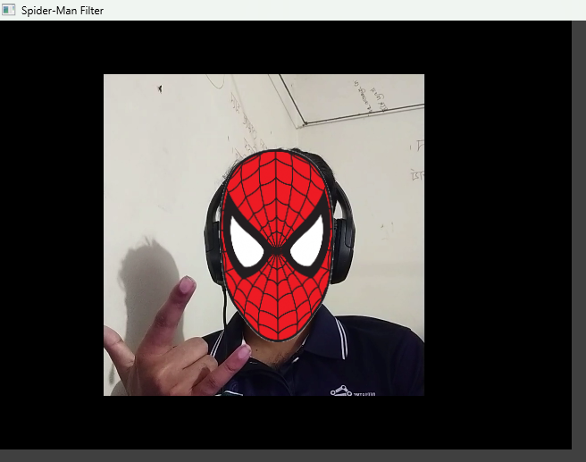

# 🕷️ FaceMask AR

> Real-time augmented reality face mask overlay powered by **MediaPipe Face Mesh** and **OpenCV**.


---

## Overview

**FaceMask AR** detects your face in real-time through a webcam and overlays a custom mask (e.g., Spider-Man) precisely onto your face. It automatically tracks head rotation, scales the mask to fit your face size, and intelligently removes only the outer white background of the mask — preserving inner details like eye whites.

---

## Features

- **Real-time face mask overlay** via webcam
- **68+ landmark tracking** using MediaPipe Face Mesh
- **Rotation-aware** — mask follows your head tilt
- **Smart background removal** — only the outer white border is removed; inner whites (e.g., eye areas) are preserved
- **Easily swappable masks** — just change the image path

---

## Project Structure

```
FaceMaskAR/
│
├── computer_vision/
│   └── filters/
│       └── spiderman.png
│
├── screenshots/
│   └── result.png
│
├── spiderman_image_mask.py
├── requirements.txt
└── README.md                   # Project documentation
```

---

## Requirements

- Python **3.10+**
- Webcam

Install dependencies:

```bash
pip install -r requirements.txt
```

**`requirements.txt`**

```
opencv-python>=4.8.0
mediapipe>=0.10.0
numpy>=1.24.0
```

---

## Usage

```bash
python spiderman_filter.py
```

- The webcam window will open automatically.
- Press **`ESC`** to exit.

---

## Screenshot

### Spider-Man AR Filter Result



## 🛠️ How It Works

```
Webcam Frame
     │
     ▼
MediaPipe Face Mesh
     │  Detects 468 facial landmarks
     ▼
Key Points Extracted
     │  Left eye corner, Right eye corner, Nose tip
     ▼
Mask Sizing & Rotation
     │  Width  = eye_distance × 2.5
     │  Height = width × 1.2
     │  Angle  = atan2(Δy, Δx) of eye line
     ▼
Smart Background Removal (FloodFill)
     │  Removes only border-connected white pixels
     │  Preserves inner white (eye whites, etc.)
     ▼
Alpha Blend onto Frame
     │  Per-pixel alpha compositing
     ▼
Display
```

---

## 🔧 Configuration

You can tweak these constants at the top of `spiderman_filter.py`:

| Constant           | Default                                 | Description                                  |
| ------------------ | --------------------------------------- | -------------------------------------------- |
| `MASK_PATH`        | `computer_vision/filters/spiderman.png` | Path to your mask image                      |
| `EYE_SCALE_FACTOR` | `2.5`                                   | Controls mask width relative to eye distance |
| `ASPECT_RATIO`     | `1.2`                                   | Controls mask height relative to width       |
| `WHITE_THRESHOLD`  | `240`                                   | Sensitivity of white background detection    |
| `EXIT_KEY`         | `27` (ESC)                              | Key to press to quit                         |

---

## Adding Custom Masks

1. Place your mask PNG inside `computer_vision/filters/`.
2. Update `MASK_PATH` in `spiderman_filter.py`:

```python
MASK_PATH = "computer_vision/filters/your_mask.png"
```

> **Tip:** For best results, use a PNG with a plain white background and make sure the mask face is centered.

---

## Dependencies

| Library         | Purpose                                  |
| --------------- | ---------------------------------------- |
| `opencv-python` | Video capture, image processing, display |
| `mediapipe`     | Face landmark detection                  |
| `numpy`         | Array operations and alpha blending      |

---

## Author

Shahriar Alom Masud  
B.Sc. Engg. in IoT & Robotics Engineering  
University of Frontier Technology, Bangladesh  
Email: shahriar0002@std.uftb.ac.bd  
LinkedIn: https://www.linkedin.com/in/shahriar-alom-masud

---

## License

This project is licensed under the [MIT License](https://opensource.org/licenses/MIT).

---

## Acknowledgements

- [MediaPipe by Google](https://mediapipe.dev/) — Face Mesh model
- [OpenCV](https://opencv.org/) — Computer vision toolkit
